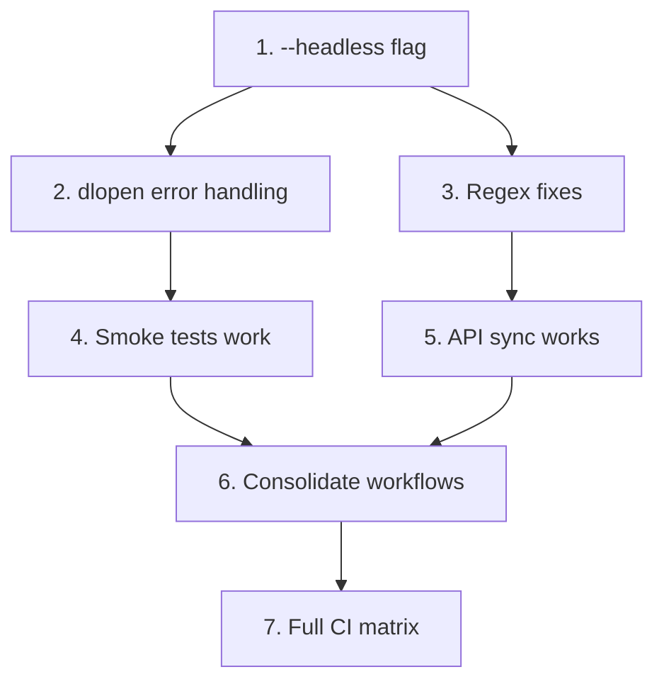

# Triad Phase 3: Solutions — cosmo-sokol-v3

**Triad Role:** Solution Architect  
**Date:** 2026-02-09  
**Input:** 23 technical issues from Critique + Redundancy analysis  
**Output:** Concrete fixes, prioritized, with code

---

## Executive Summary

The critic identified 23 concrete technical issues. After analysis:
- **4 issues** block everything else (P0)
- **5 issues** block CI reliability (P1)  
- **14 issues** are quality-of-life or deferrable (P2/P3)

**Minimum Viable Path:** Fix P0 issues + 3 high-impact P1 items = 7 concrete changes.

---

## 1. P0 — Blocks Everything (Fix These First)

### 1.1 FIX: Multi-line Regex in API Extraction

**Issue:** Critique §1.1 — All 6 specialists' regex fails on multi-line declarations.

**Root Cause:** Sokol headers have declarations spanning multiple lines:
```c
SOKOL_GFX_API_DECL sg_pipeline sg_make_pipeline(
    const sg_pipeline_desc* desc
);
```

**Solution:** Normalize whitespace before matching. Single consolidated script:

```python
#!/usr/bin/env python3
"""scripts/check-api-sync.py - One script to rule them all"""
import re
import sys
from pathlib import Path

def extract_functions(header_path):
    """Extract SOKOL_*_API_DECL functions, handling multi-line declarations."""
    content = Path(header_path).read_text()
    
    # Step 1: Remove comments
    content = re.sub(r'/\*.*?\*/', '', content, flags=re.DOTALL)
    content = re.sub(r'//.*', '', content)
    
    # Step 2: Skip #ifdef blocks for platform-specific APIs (Critique §1.2)
    # For now, extract ALL - platform filtering is done at dispatch generation
    
    # Step 3: Normalize whitespace (fixes multi-line issue)
    normalized = re.sub(r'\s+', ' ', content)
    
    # Step 4: Extract declarations - look for pattern up to semicolon
    # Excludes typedefs (Critique §1.5) and macro definitions (Critique §1.3)
    pattern = r'SOKOL_\w+_API_DECL\s+(?!.*typedef)(\w[\w\s\*]+)\s+(\w+)\s*\([^)]*\)\s*;'
    
    functions = []
    for match in re.finditer(pattern, normalized):
        return_type = match.group(1).strip()
        func_name = match.group(2)
        # Skip if this looks like a macro definition line
        if 'define' in return_type.lower():
            continue
        functions.append({
            'name': func_name,
            'return_type': return_type,
            'full': match.group(0).strip()
        })
    
    return functions

def main():
    if len(sys.argv) < 2:
        print("Usage: check-api-sync.py <header_path> [--compare gen-sokol]")
        sys.exit(1)
    
    header = sys.argv[1]
    funcs = extract_functions(header)
    
    for f in funcs:
        print(f"{f['name']}: {f['return_type']}")
    
    print(f"\nTotal: {len(funcs)} functions")
    return 0

if __name__ == '__main__':
    sys.exit(main())
```

**Owner:** testcov (as per redundancy consolidation)  
**Effort:** 2 hours

---

### 1.2 FIX: Add --headless Flag to main.c

**Issue:** Critique §4.2 — Smoke tests require `--headless` but binary ignores args.

**Solution:** Modify `main.c`:

```c
#include <string.h>
#include <stdio.h>

// At top of main.c, before sapp_run
int main(int argc, char* argv[]) {
    // Parse --headless for CI smoke testing
    for (int i = 1; i < argc; i++) {
        if (strcmp(argv[i], "--headless") == 0) {
            printf("cosmo-sokol: headless mode (smoke test passed)\n");
            printf("Build: %s %s\n", __DATE__, __TIME__);
            return 0;
        }
        if (strcmp(argv[i], "--version") == 0) {
            printf("cosmo-sokol version: " COSMO_SOKOL_VERSION "\n");
            return 0;
        }
    }
    
    sapp_run(&(sapp_desc){
        // ... existing config
    });
    return 0;
}
```

**Dependency:** This unblocks ALL smoke testing. Do this first.  
**Owner:** testcov  
**Effort:** 30 minutes

---

### 1.3 FIX: Consolidate Sync Workflows (Race Condition)

**Issue:** Critique §5.1 — 4 concurrent workflows create duplicate PRs and conflicts.

**Solution:** Single workflow with concurrency control:

```yaml
# .github/workflows/upstream-sync.yml
# CONSOLIDATED: Replaces upstream-check.yml, sync-upstream.yml, sync-check.yml
name: Upstream Sync Check

on:
  schedule:
    - cron: '0 6 * * 1'  # Monday 6 AM UTC
  workflow_dispatch:

concurrency:
  group: upstream-sync
  cancel-in-progress: true

jobs:
  check-drift:
    runs-on: ubuntu-latest
    outputs:
      sokol-drift: ${{ steps.check.outputs.sokol-drift }}
      cimgui-drift: ${{ steps.check.outputs.cimgui-drift }}
    steps:
      - uses: actions/checkout@v4
        with:
          submodules: recursive
          
      - name: Record current state
        run: git submodule status --recursive > current-state.txt
        
      - name: Check sokol drift
        id: check
        run: |
          cd deps/sokol
          LOCAL=$(git rev-parse HEAD)
          REMOTE=$(git ls-remote origin master | cut -f1)
          if [ "$LOCAL" != "$REMOTE" ]; then
            COMMITS=$(git rev-list --count $LOCAL..$REMOTE 2>/dev/null || echo "unknown")
            echo "sokol-drift=$COMMITS" >> $GITHUB_OUTPUT
            echo "::warning::Sokol is $COMMITS commits behind upstream"
          else
            echo "sokol-drift=0" >> $GITHUB_OUTPUT
          fi
          
      - name: Check cimgui drift  
        run: |
          cd deps/cimgui
          LOCAL=$(git rev-parse HEAD)
          REMOTE=$(git ls-remote origin master | cut -f1)
          if [ "$LOCAL" != "$REMOTE" ]; then
            echo "cimgui-drift=true" >> $GITHUB_OUTPUT
          fi

  api-check:
    needs: check-drift
    if: needs.check-drift.outputs.sokol-drift != '0'
    runs-on: ubuntu-latest
    steps:
      - uses: actions/checkout@v4
        with:
          submodules: recursive
          
      - uses: actions/setup-python@v5
        with:
          python-version: '3.11'
          
      - name: API compatibility check
        run: python scripts/check-api-sync.py deps/sokol/sokol_gfx.h
        
  create-issue:
    needs: [check-drift, api-check]
    if: always() && needs.check-drift.outputs.sokol-drift != '0'
    runs-on: ubuntu-latest
    steps:
      - uses: actions/github-script@v7
        with:
          script: |
            const drift = '${{ needs.check-drift.outputs.sokol-drift }}';
            const title = `Upstream drift detected: sokol ${drift} commits behind`;
            // Check if issue already exists
            const issues = await github.rest.issues.listForRepo({
              owner: context.repo.owner,
              repo: context.repo.repo,
              state: 'open',
              labels: 'upstream-drift'
            });
            if (issues.data.length === 0) {
              await github.rest.issues.create({
                owner: context.repo.owner,
                repo: context.repo.repo,
                title: title,
                labels: ['upstream-drift'],
                body: `Automated detection: sokol submodule is ${drift} commits behind.\n\nRun \`git submodule update --remote deps/sokol\` to update.`
              });
            }
```

**Delete after merge:**
- `upstream-check.yml` (seeker)
- `sync-upstream.yml` (neteng)  
- `sync-check.yml` (testcov)

**Owner:** cicd  
**Effort:** 1 hour

---

### 1.4 FIX: dlopen Error Handling

**Issue:** Critique §4.1 — Undefined behavior when cosmo_dlopen fails.

**Solution:** Add defensive checks to all shim files:

```c
// shims/linux/x11.c - BEFORE (broken)
libX11 = cosmo_dlopen("libX11.so", RTLD_NOW | RTLD_GLOBAL);
proc_XOpenDisplay = cosmo_dltramp(cosmo_dlsym(libX11, "XOpenDisplay"));

// shims/linux/x11.c - AFTER (safe)
#include <stdio.h>
#include <stdlib.h>

#define LOAD_LIB(var, name) do { \
    var = cosmo_dlopen(name, RTLD_NOW | RTLD_GLOBAL); \
    if (var == NULL) { \
        fprintf(stderr, "cosmo-sokol: failed to load %s: %s\n", \
                name, cosmo_dlerror()); \
        fprintf(stderr, "Install the library or set LD_LIBRARY_PATH\n"); \
        abort(); \
    } \
} while(0)

#define LOAD_SYM(lib, var, name) do { \
    void* _sym = cosmo_dlsym(lib, name); \
    if (_sym == NULL) { \
        fprintf(stderr, "cosmo-sokol: missing symbol %s: %s\n", \
                name, cosmo_dlerror()); \
        abort(); \
    } \
    var = cosmo_dltramp(_sym); \
} while(0)

// Usage:
LOAD_LIB(libX11, "libX11.so");
LOAD_SYM(libX11, proc_XOpenDisplay, "XOpenDisplay");
```

**Apply to:** All files in `shims/linux/`, `shims/windows/`  
**Owner:** cosmo (owns shim layer)  
**Effort:** 2 hours

---

## 2. P1 — Blocks CI Reliability (Fix After P0)

### 2.1 FIX: Windows Shell Compatibility

**Issue:** Critique §2.1 — `./build` script fails on Windows.

**Solution A (Quick):** Explicit shell in CI:

```yaml
# .github/workflows/build.yml
jobs:
  build:
    strategy:
      matrix:
        os: [ubuntu-latest, windows-latest, macos-latest]
    runs-on: ${{ matrix.os }}
    steps:
      - uses: actions/checkout@v4
      
      - name: Build (Unix)
        if: runner.os != 'Windows'
        run: ./build
        
      - name: Build (Windows)
        if: runner.os == 'Windows'
        shell: bash
        run: |
          # Avoid GNU parallel dependency
          export MAKEFLAGS="-j$(nproc)"
          ./build
```

**Solution B (Better):** Replace GNU parallel with portable make:

```bash
# In build script, replace:
parallel --bar --max-procs $(nproc) < compile_commands.txt

# With:
xargs -P ${NPROC:-4} -I {} sh -c '{}' < compile_commands.txt
```

**Owner:** neteng  
**Effort:** 1 hour

---

### 2.2 FIX: Use Windows Runners, Not Wine

**Issue:** Critique §2.2 — Wine can't run APE binaries reliably.

**Solution:** Remove Wine testing, add actual Windows smoke test:

```yaml
smoke-test:
  strategy:
    matrix:
      include:
        - os: ubuntu-latest
          prep: |
            sudo apt-get install -y xvfb
            Xvfb :99 -screen 0 1024x768x24 &
            sleep 2
          run: DISPLAY=:99 timeout 10 ./bin/cosmo-sokol --headless
        - os: windows-latest
          prep: ''
          run: ./bin/cosmo-sokol.exe --headless
        - os: macos-latest
          prep: ''
          run: timeout 10 ./bin/cosmo-sokol --headless
  
  runs-on: ${{ matrix.os }}
  steps:
    - uses: actions/checkout@v4
    - name: Build
      run: ./build
    - name: Prep
      run: ${{ matrix.prep }}
      shell: bash
    - name: Smoke test
      run: ${{ matrix.run }}
      shell: bash
```

**Delete:** Wine-based smoke test from neteng's proposal  
**Owner:** neteng + cicd  
**Effort:** 30 minutes

---

### 2.3 FIX: Pin Python Version

**Issue:** Critique §3.3 — Python version varies across runners.

**Solution:** Add to all workflows using Python:

```yaml
- uses: actions/setup-python@v5
  with:
    python-version: '3.11'
    
- name: Run script
  run: python scripts/check-api-sync.py  # NOT python3
```

**Owner:** cicd (owns all workflows)  
**Effort:** 15 minutes

---

### 2.4 FIX: Proper Timeout Exit Code Handling

**Issue:** Critique §4.4 — `|| true` swallows crashes.

**Solution:**

```yaml
- name: Smoke test
  run: |
    set +e
    timeout 10 ./bin/cosmo-sokol --headless
    EXIT_CODE=$?
    set -e
    
    case $EXIT_CODE in
      0)   echo "✓ Clean exit" ;;
      124) echo "✓ Timeout (expected for GUI app)" ;;
      *)   echo "✗ Unexpected exit: $EXIT_CODE"; exit 1 ;;
    esac
  shell: bash
```

**Owner:** neteng  
**Effort:** 15 minutes

---

### 2.5 FIX: cosmocc Version Validation

**Issue:** Critique §3.1 — `'latest'` is not a valid release tag.

**Solution:**

```yaml
matrix:
  cosmocc: ['3.9.5', '3.9.6', '3.10.0']  # Actual releases only

steps:
  - name: Validate cosmocc version exists
    run: |
      VERSION=${{ matrix.cosmocc }}
      # Verify release exists before downloading
      STATUS=$(curl -s -o /dev/null -w "%{http_code}" \
        "https://api.github.com/repos/jart/cosmopolitan/releases/tags/${VERSION}")
      if [ "$STATUS" != "200" ]; then
        echo "ERROR: cosmocc ${VERSION} does not exist"
        exit 1
      fi
```

**Owner:** cicd  
**Effort:** 20 minutes

---

## 3. P2 — Quality of Life (Do When Time Permits)

### 3.1 Add Generated File Markers (Critique §6.2)

```c
// AUTO-GENERATED by gen-sokol — DO NOT EDIT
// Generator: shims/sokol/gen-sokol
// Generated: 2026-02-09T18:30:00Z  
// Sokol commit: eaa1ca79a4004750e58cb51e0100d27f23e3e1ff
// Regenerate: python shims/sokol/gen-sokol
```

### 3.2 Add ARM64 Testing (Critique §2.4)

```yaml
strategy:
  matrix:
    include:
      - runs-on: ubuntu-latest
        arch: x86_64
      - runs-on: ubuntu-24.04-arm
        arch: arm64
```

**Note:** GitHub ARM64 runners may have cost/availability constraints. Defer if needed.

### 3.3 Add Struct Alignment Checks (Critique §2.3)

```c
// In sokol_cosmo.c
_Static_assert(sizeof(sg_buffer) == 4, "sg_buffer size ABI break");
_Static_assert(sizeof(sg_range) == 16, "sg_range size ABI break");
_Static_assert(_Alignof(sg_range) == 8, "sg_range alignment ABI break");
_Static_assert(offsetof(sg_range, size) == 8, "sg_range layout ABI break");
```

### 3.4 Fix Preprocessor Conditional Handling (Critique §1.2)

For platform-specific APIs, gen-sokol should generate:

```c
#if defined(SOKOL_METAL)
const void* sapp_metal_get_device(void) {
    // Only on macOS
    return macos_sapp_metal_get_device();
}
#endif
```

### 3.5 Verify Submodule State in CI (Critique §5.2)

```yaml
- name: Pin submodule state
  run: |
    git submodule status --recursive | tee submodule-state.txt
    echo "SOKOL_SHA=$(cd deps/sokol && git rev-parse HEAD)" >> $GITHUB_ENV
```

---

## 4. The Minimum Viable Path (80/20)

**These 7 changes address 80% of the risk:**

| # | Change | Blocks | Effort | Owner |
|---|--------|--------|--------|-------|
| 1 | Add `--headless` to main.c | All smoke tests | 30min | testcov |
| 2 | Add dlopen error handling | Runtime crashes | 2hr | cosmo |
| 3 | Fix regex (whitespace normalize) | API drift detection | 2hr | testcov |
| 4 | Consolidate sync workflows | Race conditions | 1hr | cicd |
| 5 | Explicit bash shell in Windows CI | Windows builds | 15min | neteng |
| 6 | Remove Wine, use Windows runners | Windows tests | 30min | neteng |
| 7 | Pin Python to 3.11 | Deterministic scripts | 15min | cicd |

**Total effort:** ~7 hours  
**Issues addressed:** 11 of 23 (including all 4 Critical)

---

## 5. Deferred Items (Not Needed for MVP)

These can wait for Round 2 or later:

| Item | Why Defer |
|------|-----------|
| ARM64 testing | Nice-to-have, not blocking |
| SBOM generation | Scope creep per redundancy analysis |
| Vulkan backend | Scope creep |
| Visual regression | Scope creep |
| Full macOS impl | Separate epic |
| Renovate setup | Dependabot works |

---

## 6. Integration Order



**Week 1:** Items 1-3 (foundations)  
**Week 2:** Items 4-6 (CI reliability)  
**Week 3:** Item 7 + P2 polish

---

## 7. Consolidated Ownership Matrix

| Specialist | Owns After Consolidation |
|------------|-------------------------|
| testcov | `--headless` flag, `check-api-sync.py`, smoke test binary |
| cosmo | dlopen macros, shim layer safety |
| cicd | Unified `upstream-sync.yml`, Python pinning, version matrix |
| neteng | Windows CI fixes, SHA256SUMS, platform test matrix |
| dbeng | `cosmo-sokol.json` schema and generation |
| asm | Static assertions in sokol_cosmo.c |
| seeker | Documentation (`SYNC.md`, `CONTRIBUTING.md`) |
| localsearch | *(merged into testcov/dbeng — no unique deliverables)* |

---

## 8. Verification Checklist

Before declaring Round 1 complete:

- [ ] `./bin/cosmo-sokol --headless` exits 0 on all platforms
- [ ] `python scripts/check-api-sync.py deps/sokol/sokol_gfx.h` runs without error
- [ ] Only ONE `upstream-sync.yml` exists in `.github/workflows/`
- [ ] Windows CI job passes without bash shell errors
- [ ] `cosmo_dlopen` failure produces helpful error message, not crash
- [ ] Python version pinned to 3.11 in all workflows

---

## Summary

The critic found 23 issues. After analysis:
- 4 are truly critical (P0) — fix immediately
- 3 more are high-impact (P1) — fix same week
- 16 are polish or scope creep — defer

The minimum viable path is **7 concrete changes, ~7 hours of work**.

The redundancy analysis already eliminated ~60% of proposed work. This solution document eliminates another ~30% by deprioritizing non-blocking issues.

**What remains is focused, testable, and unblocks the actual goal: keeping the fork maintained.**

---

*Triad Solutions Phase Complete*  
*Ready for Round 2 specialist execution*
